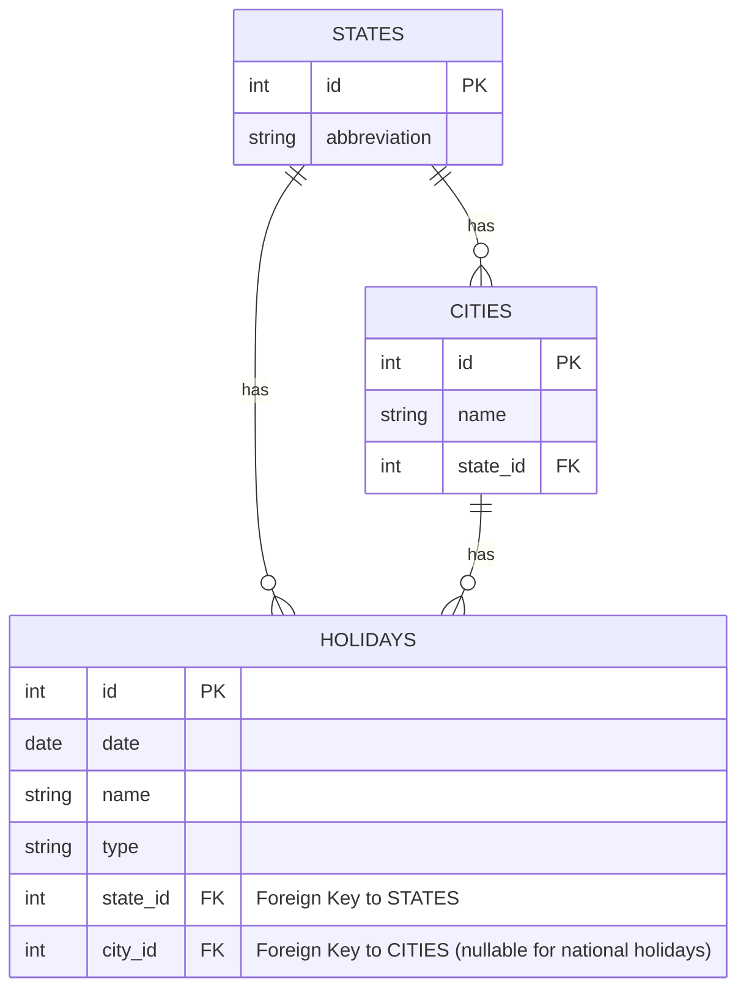

# Solution

## Excel file handling
- Tech Used:
  - <strong>Apache POI</strong>: A Java API for Microsoft Documents (Excel)
  - File format: OOXML as it's Microsoft Excel (2007+) file with extension <strong>.xlsx</strong>
- Data extracting:
    - The data was only on <strong>two columns [A,B]</strong> inside only one sheet.
    - Thus service was coded as data was present.

E.g.:

|   A    |     B    |
|--------|----------|
| ESTADO | CIDADE   |
| SP     | BAURU    |
| SP     | BOTUCATU |
| SP     | FARTURA  |
| PR     | MARINGA  |

- PS: This solution could be improved to allow a more generic solution if needed.

## RPA
- Tech Used:
  - Selenium [REQUIRED]
  - Webdriver manager - To handle webdriver versions

- There were 3 approaches found:
  1. <strong>UI interaction</strong>: 2 selectors with <strong>ID "estado"</strong> and <strong>ID "cidade"</strong>
  2. <strong>Cookies</strong>: 2 cookies name-value pair: <strong>cidade</strong> and <strong>estado</strong>
  3. <strong>URI</strong>: The URI follows a pattern described bellow:
     - [BASEURL] [CITY] [STATE] [PHP SCRIPT] [OPTIONAL YEAR]
---
    [BASE URL]: https://www.feriados.com.br/feriados-
    [CITY]: gaviao_peixoto-
    [STATE]: sp
    [PHP SCRIPT]: .php?
    [OPTIONAL YEAR]: ano=2024

    FINAL URI FORMAT: https://www.feriados.com.br/feriados-gaviao_peixoto-sp.php?ano=2030

### The approach chosen to implement the RPA was the first option.
- Reasons:
  - As the selector had the value and content with and without locale accent, it was a secure option to scrap the data
  - Cookies interaction were not considered as the city names were not using locale accent.
  - URI was at first implemented, but there were some sanitization needed in order to work, overly complicating it, when compared to UI Interaction.

### Assumptions
> 1) The problem asked to extract data from MUNICIPAL and NACIONAL holidays. 
>
>   1.1) Thus were excluded holidays that were classified as optional or other.
> 2) Misspellings were NOT corrected, such as the first city of Excel Data AltEneira, which should be AltAneira
>
>   2.1) This decision was done as in a greater dataset it should be manually corrected, to avoid a misspelling being correct to something similar, such as: PIRAJU and PIRAJUÍ, which are both corrected cities.

## DATABASE

## API