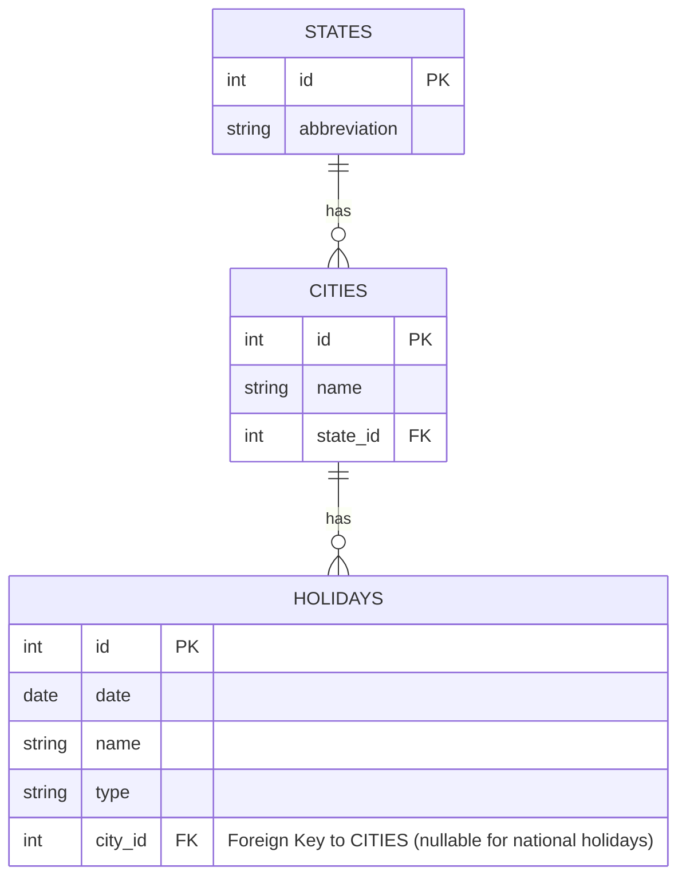

# Solução PT-BR

## Manipulação de Arquivo Excel

- Tecnologias Utilizadas:
    - Ache POI: Uma API Java para documentos Microsoft (Excel)
    - Formato do arquivo: OOXML, pois se trata de um arquivo Microsoft Excel (2007+) com extensão
      .xlsx
    - Extração de dados:
        - Os dados estavam presentes em duas colunas [A,B] dentro de apenas uma planilha.
        - Portanto, o serviço foi codado considerando essa estrutura dos dados.

Ex:

| A      | B        |
|--------|----------|
| ESTADO | CIDADE   |
| SP     | BAURU    |
| SP     | BOTUCATU |
| SP     | FARTURA  |
| PR     | MARINGA  |

OBS: Essa solução poderia ser melhorada para permitir uma abordagem mais genérica, se necessário.

## RPA

- Tecnologias Utilizadas:
    - Selenium [OBRIGATÓRIO]
    - Webdriver Manager - Para gerenciar as versões do webdriver

- Foram encontradas 3 abordagens:
    1. Interação com UI: 2 seletores com ID “estado” e ID “cidade”
    2. Cookies: 2 pares nome-valor de cookies: cidade e estado
    3. URI: O padrão da URI segue a estrutura descrita abaixo:
        - [BASEURL] [CIDADE] [ESTADO] [SCRIPT PHP] [ANO OPCIONAL]

---

    [BASE URL]: https://www.feriados.com.br/feriados-
    [CITY]: gaviao_peixoto-
    [STATE]: sp
    [PHP SCRIPT]: .php?
    [OPTIONAL YEAR]: ano=2024

    FINAL URI FORMAT: https://www.feriados.com.br/feriados-gaviao_peixoto-sp.php?ano=2030

A abordagem escolhida para implementar o RPA foi a primeira opção.

- Motivos:
    - O seletor tinha o valor e conteúdo com e sem acentuação, foi uma opção segura para a coleta
      dos dados
    - A interação com cookies não foi considerada, pois os nomes das cidades não estavam usando
      acentuação.
    - A URI foi inicialmente implementada, mas exigia muita sanitização para funcionar, complicando
      demais a solução em comparação à interação com a UI.

### Suposições

O problema pediu para extrair dados de feriados MUNICIPAIS e NACIONAIS.

Portanto, foram excluídos feriados classificados como opcionais ou outros.

Erros de digitação NÃO foram corrigidos, como, por exemplo, a primeira cidade do Excel,
AltEneira, que deveria ser AltAneira.

Essa decisão foi tomada porque, num conjunto de dados maior, deve-se corrigir
manualmente para evitar que um erro de digitação seja corrigido para algo similar, como: PIRAJU
e PIRAJUÍ, que são cidades diferentes e ambas corretas.



## API

#### Return content from Database

```http
  GET /api/holidays/preview
```

| Parâmetro | Tipo | Descrição                           |
|:----------|:-----|:------------------------------------|
|           |      | Mostra os dados coletados pelo RPA. |

#### Send data to external API

```http
  POST /api/holidays/send
```

| Parâmetro | Tipo | Descrição                  |
|:----------|:-----|:---------------------------|
|           |      | Necessário token no header |

### COMO EXECUTAR A API:

1) Rodar o docker compose utilizando: docker compose up -d
2) Executar a aplicação: mvn spring-boot:run
3) Realizar o POST na rota /api/holidays/send

# Solution EN-US

## Excel file handling

- Tech Used:
    - <strong>Apache POI</strong>: A Java API for Microsoft Documents (Excel)
    - File format: OOXML as it's Microsoft Excel (2007+) file with extension <strong>.xlsx</strong>
- Data extracting:
    - The data was only on <strong>two columns [A,B]</strong> inside only one sheet.
    - Thus service was coded as data was present.

E.g.:

| A      | B        |
|--------|----------|
| ESTADO | CIDADE   |
| SP     | BAURU    |
| SP     | BOTUCATU |
| SP     | FARTURA  |
| PR     | MARINGA  |

- PS: This solution could be improved to allow a more generic solution if needed.

## RPA

- Tech Used:
    - Selenium [REQUIRED]
    - Webdriver manager - To handle webdriver versions

- There were 3 approaches found:
    1. <strong>UI interaction</strong>: 2 selectors with <strong>ID "estado"</strong> and <strong>
       ID "cidade"</strong>
    2. <strong>Cookies</strong>: 2 cookies name-value pair: <strong>cidade</strong> and <strong>
       estado</strong>
    3. <strong>URI</strong>: The URI follows a pattern described bellow:
        - [BASEURL] [CITY] [STATE] [PHP SCRIPT] [OPTIONAL YEAR]

---

    [BASE URL]: https://www.feriados.com.br/feriados-
    [CITY]: gaviao_peixoto-
    [STATE]: sp
    [PHP SCRIPT]: .php?
    [OPTIONAL YEAR]: ano=2024

    FINAL URI FORMAT: https://www.feriados.com.br/feriados-gaviao_peixoto-sp.php?ano=2030

### The approach chosen to implement the RPA was the first option.

- Reasons:
    - As the selector had the value and content with and without locale accent, it was a secure
      option to scrap the data
    - Cookies interaction were not considered as the city names were not using locale accent.
    - URI was at first implemented, but there were some sanitization needed in order to work, overly
      complicating it, when compared to UI Interaction.

### Assumptions

> 1) The problem asked to extract data from MUNICIPAL and NACIONAL holidays.
     >
     >   1.1) Thus were excluded holidays that were classified as optional or other.
> 2) Misspellings were NOT corrected, such as the first city of Excel Data AltEneira, which should
     be AltAneira
     >
     >   2.1) This decision was done as in a greater dataset it should be manually corrected, to
     avoid a misspelling being correct to something similar, such as: PIRAJU and PIRAJUÍ, which are
     both corrected cities.

## DATABASE


## API

#### Return content from Database

```http
  GET /api/holidays/preview
```

| Parâmetro | Tipo | Descrição                                                    |
|:----------|:-----|:-------------------------------------------------------------|
|           |      | **Mandatory**. Running the scrapper to populate the database |

#### Send data to external API

```http
  POST /api/holidays/send
```

| Parâmetro | Tipo | Descrição                            |
|:----------|:-----|:-------------------------------------|
|           |      | **Mandatory**. Needs token on header |

